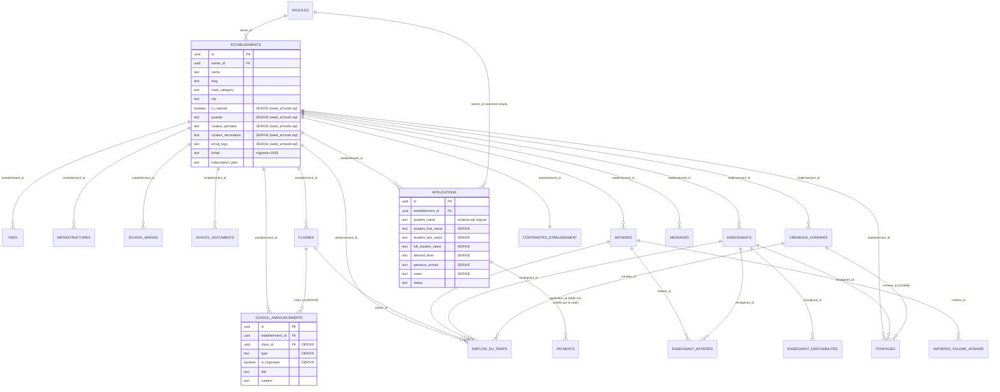

# 05 — Database Current State

**Avertissement méthodologique** : ce document reconstitue le schéma à partir de trois sources qui ne concordent pas parfaitement : (1) `supabase/schema.sql`, (2) `supabase/migrations/*.sql` + `auth-setup.sql`, (3) les colonnes réellement lues/écrites par le code applicatif. Quand une colonne est utilisée par le code sans apparaître dans (1) ou (2), elle est marquée **[DÉRIVE]** — c'est-à-dire probablement ajoutée directement en base via l'éditeur SQL Supabase, hors du dépôt Git, comme le préconise d'ailleurs `CLAUDE_CONTEXT.md` ("Toute modification de schéma Supabase passe par SQL Editor"). Cette pratique documentée elle-même explique la dérive constatée.

## 1. Tables confirmées par `schema.sql`

### `profiles`
- `id` (PK, `references auth.users`)
- `full_name`, `phone`, `role` (`user_role` enum), `created_at`
- RLS : lecture/écriture de son propre profil ; insertion de son propre profil (`auth-setup.sql`)
- Utilisée par : middleware, callback auth, connexion, tous les layouts qui vérifient un rôle

### `establishments`
- Colonnes du schéma initial : `id`, `owner_id`, `name`, `slug`, `main_category`, `sub_category`, `ownership_type`, `description`, `region`, `department`, `city`, `arrondissement`, `neighborhood`, `address`, `latitude`, `longitude`, `phone`, `whatsapp`, `email`, `website`, `logo_url`, `cover_image_url`, `is_verified`, `is_featured`, `accepts_online_payment`, `subscription_plan`, `created_at`, `updated_at`
- **[DÉRIVE] ajoutées par `seed_schools.sql`** : `is_claimed` (boolean), `quartier` (text — coexiste avec `neighborhood`, les deux sont lues séparément dans `page.tsx`), `couleur_primaire`, `couleur_secondaire`, `emoji_logo`
- **Ajoutée par `0005_forfait_multi_etab.sql`** (migration versionnée, donc pas une dérive) : `forfait` (`gratuit`/`gere`/`pro`)
- **NON TROUVÉES dans le dépôt** malgré leur mention dans `CLAUDE_CONTEXT.md` comme "à ajouter" : `plan_type`, `module_pro_actif`. NON VÉRIFIÉ si elles existent en base malgré tout.
- RLS connue : lecture publique (`true`) ; `INSERT`/`UPDATE` uniquement si `owner_id = auth.uid()`. **Aucune policy pour `platform_admin`** trouvée — voir `04_AUTH_AND_ROLES.md` §4c et `06_SECURITY_AUDIT.md`.
- Utilisée par : quasiment toutes les routes publiques et le dashboard école/admin

### `fees`
- `id`, `establishment_id`, `registration_fee`, `tuition_fee`, `transport_fee`, `canteen_fee`, `uniform_fee`, `exam_fee`, `other_fees`, `currency`, `created_at`
- RLS : lecture publique ; insertion/mise à jour par le propriétaire de l'établissement parent (`auth-setup.sql`)
- Cohérente avec le code (`dashboard/ecole/frais`, fiche publique)

### `infrastructures`
- `id`, `establishment_id`, 10 colonnes booléennes (`library`, `laboratory`, `computer_room`, `sports_field`, `canteen`, `boarding`, `transport`, `security`, `wifi`, `infirmary`), `created_at`
- RLS : lecture publique ; insertion/mise à jour par le propriétaire
- Cohérente avec le code

### `establishment_images` / `documents`
- Déclarées dans `schema.sql` mais le code applicatif utilise en réalité **`school_images`** et **`school_documents`** (voir plus bas, définies dans `auth-setup.sql`). NON VÉRIFIÉ si `establishment_images`/`documents` sont encore utilisées quelque part en production ou si elles sont un vestige totalement remplacé.

### `applications`
- Colonnes du schéma initial : `id`, `parent_id`, `establishment_id`, `student_name`, `student_age`, `student_level`, `parent_name`, `parent_phone`, `parent_email`, `message`, `status` (`application_status` enum), `created_at`
- **[DÉRIVE] colonnes utilisées par le code sans migration trouvée** : `student_first_name`, `student_last_name`, `full_student_name`, `desired_level` (remplace apparemment `student_level`), `previous_school`, `notes` — vues dans `src/app/preinscription/page.tsx`, `src/app/dashboard/ecole/admissions/page.tsx`, `src/app/dashboard/ecole/page.tsx`
- RLS connue : insertion publique (`auth-setup.sql`, remplace la policy initiale "authenticated only") ; lecture par le parent (`parent_id`) ou par le propriétaire de l'établissement ; mise à jour du statut par le propriétaire
- **Remarque** : `parent_id` n'est jamais renseigné par `preinscription/page.tsx` (le formulaire ne requiert pas de compte) — cohérent avec l'objectif "sans compte requis", mais signifie que la policy `Parents can read own applications` ne peut jamais s'appliquer à ces dossiers créés sans compte.

### `payments`
- Déclarée dans `schema.sql` (`id`, `application_id`, `amount`, `method`, `status`, `transaction_reference`, `created_at`) — **aucune requête vers cette table trouvée nulle part dans le code applicatif**. Table présente en base (probablement) mais totalement inutilisée par le frontend actuel.

## 2. Tables confirmées par `auth-setup.sql`

### `classes`
- `id`, `establishment_id`, `name`, `level`, `teacher_name`, `created_at`
- RLS : lecture publique ; gestion complète par le propriétaire
- Cohérente avec le code (`dashboard/ecole/classes`)

### `school_announcements`
- **Colonnes réelles de production, confirmées par sonde live (CMS-E, 2026-08-22)** : `id`, `establishment_id`, `title`, `content` (**NOT NULL**), `is_important`, `created_at`, `class_id`, `type`.
- **[CORRECTION]** `published_at` est **absente en production**, malgré sa déclaration dans `auth-setup.sql` (ligne 118). Cette page listait auparavant `published_at` comme colonne déclarée existante — c'était faux, corrigé ici. Ne jamais sélectionner cette colonne côté application (voir `src/app/api/school-page/news/route.ts`, déjà conforme). Détail complet : `docs/04_SUPABASE_PROD_READINESS/01_SCHEMA_DRIFT.md`.
- `is_important`, `class_id`, `type` : comblés par `0007_production_security_reconciliation.sql` (`is_important` boolean, `class_id` FK vers `classes` avec `on delete cascade`, `type` avec contrainte `check` sur `announcement`/`homework`/`event`/`reminder`) — utilisés dans `dashboard/ecole/annonces`, `dashboard/ecole/classes/[id]/page.tsx`, et `src/app/api/school-page/news/route.ts` (CMS-E).
- RLS : lecture publique ; gestion complète par le propriétaire.

### `school_images` / `school_documents`
- `id`, `establishment_id`, `url`, `storage_path`, `caption`/`name`+`type`, `created_at`
- RLS : lecture publique ; gestion complète par le propriétaire
- Cohérentes avec le code (galerie, documents)

## 3. Tables du module Pro (migrations `0001` à `0005`, versionnées et cohérentes avec le code)

| Table | Rôle | Clé primaire | Clés étrangères | RLS |
|---|---|---|---|---|
| `enseignants` | Fiche enseignant (créée par l'établissement, liée à un compte auth à l'invitation) | `id` | `etablissement_id → establishments`, `user_id → auth.users` (nullable) | `enseignants_scope` (établissement courant) + `enseignants_self_read` (soi-même) |
| `matieres` | Matières enseignées, avec département disciplinaire | `id` | `etablissement_id → establishments` | `matieres_scope` |
| `matieres_volume_horaire` | Heures/semaine par matière et niveau | `id` | `matiere_id → matieres` | `mvh_scope` |
| `enseignant_matieres` | Association enseignant ↔ matières | PK composite | `enseignant_id`, `matiere_id` | `em_scope` |
| `enseignant_disponibilites` | Disponibilités hebdomadaires | `id` | `enseignant_id → enseignants` | `ed_scope` |
| `contraintes_etablissement` | Paramètres d'amplitude horaire (1 ligne/établissement) | `etablissement_id` (PK) | `→ establishments` | `contraintes_scope` |
| `creneaux_horaires` | Grille de créneaux générée | `id` | `etablissement_id → establishments` | `creneaux_scope` |
| `emplois_du_temps` | Affectations classe/matière/enseignant/créneau | `id` | 4 FK (`classe_id`, `matiere_id`, `enseignant_id`, `creneau_id`) | `edt_scope` |
| `pointages` | Événements arrivée/départ avec photo | `id` | `etablissement_id`, `enseignant_id`, `creneau_id` (nullable) | `pointages_scope` + `pointages_self_read` |
| `messages` | Messagerie interne (globale ou par département) | `id` | `etablissement_id`, `auteur_id → auth.users` | `messages_directeur` + `messages_enseignant_read` |

Toutes ces policies s'appuient sur la fonction `current_establishment_id()` (`security definer`, définie dans `0001_timetable_schema.sql`), qui résout l'établissement de l'utilisateur connecté via `establishments.owner_id = auth.uid()`. C'est une fonction centrale et bien conçue pour ce sous-système.

## 4. Tables mentionnées dans `CLAUDE_CONTEXT.md` mais absentes du code et des migrations

| Table/colonne prévue | Statut réel |
|---|---|
| `pre_inscriptions` (avec `code_suivi` auto-généré) | **ABSENTE** — le flux de préinscription réel utilise `applications` |
| `establishments.plan_type`, `establishments.module_pro_actif` | **ABSENTES** — le concept réellement implémenté est `establishments.forfait` |
| `sections` (`ecole_id`, `nom`, `responsable_id`, `type`) | **ABSENTE** — aucune trace |

## 5. Stockage (Supabase Storage)

| Bucket | Créé par | Public | Policy connue |
|---|---|---|---|
| `pointages-photos` | `0002_presence.sql` (SQL versionné) | Non | `pointages_owner_access` — accès limité au dossier `{etablissement_id}/...` de l'établissement courant |
| `school-images` | NON VÉRIFIÉ (mentionné en commentaire dans `auth-setup.sql` comme "à créer via le dashboard Supabase", pas de SQL `insert into storage.buckets`) | Documenté comme public | Policies décrites en commentaire seulement — NON VÉRIFIABLE si appliquées |
| `school-documents` | Idem | Documenté comme public | Idem |

## 6. Diagramme relationnel (état reconstitué, dérives incluses)

## 7. Synthèse des risques liés aux données

| Constat | Preuve | Impact |
|---|---|---|
| Colonnes de production non versionnées sur 3 tables au moins | Comparaison code ↔ `schema.sql`/`auth-setup.sql` | Impossible de recréer un environnement fidèle depuis ce dépôt seul |
| Table `pre_inscriptions` documentée mais jamais créée | `CLAUDE_CONTEXT.md` vs. code | Décision produit à trancher (garder `applications` ou migrer) |
| Colonnes `plan_type`/`module_pro_actif` documentées mais jamais créées | `CLAUDE_CONTEXT.md` vs. code | Le modèle réel (`forfait`) doit devenir la référence documentée |
| Policy `UPDATE` manquante pour `platform_admin` sur `establishments` | `schema.sql` (policies listées) vs. `dashboard/admin/ecoles/[id]/page.tsx` | Voir `06_SECURITY_AUDIT.md` R-001 |
| Table `payments` inutilisée | Absence totale de requête dans le code | Fonctionnalité de paiement à construire entièrement si toujours souhaitée |
