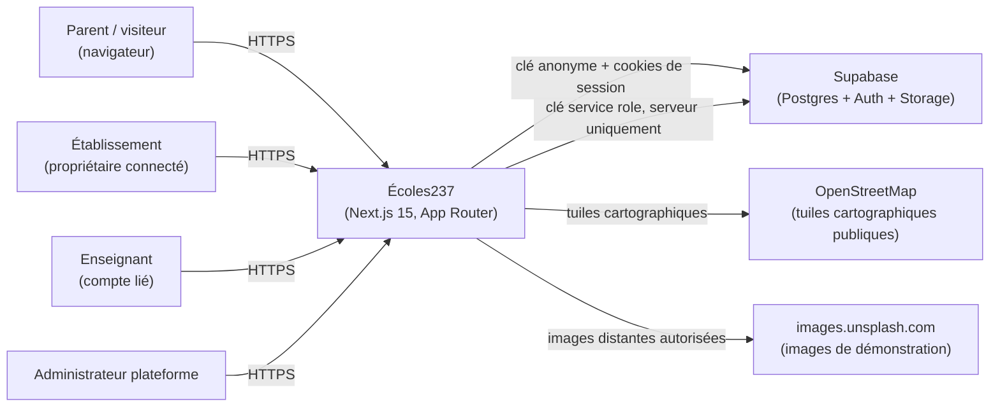
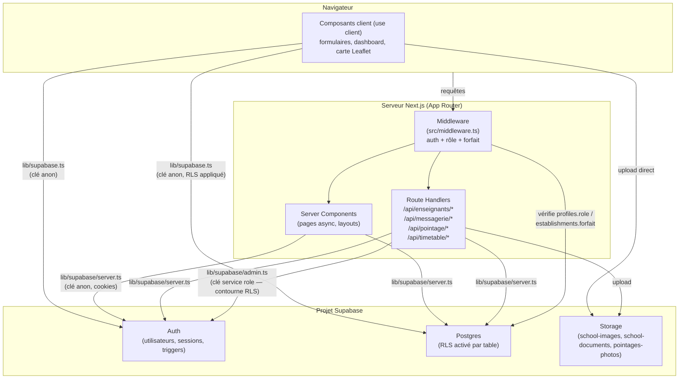
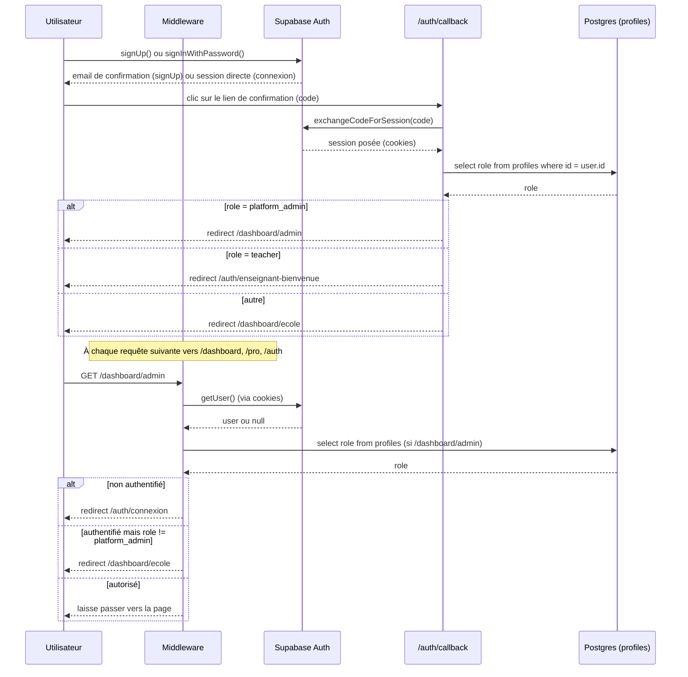
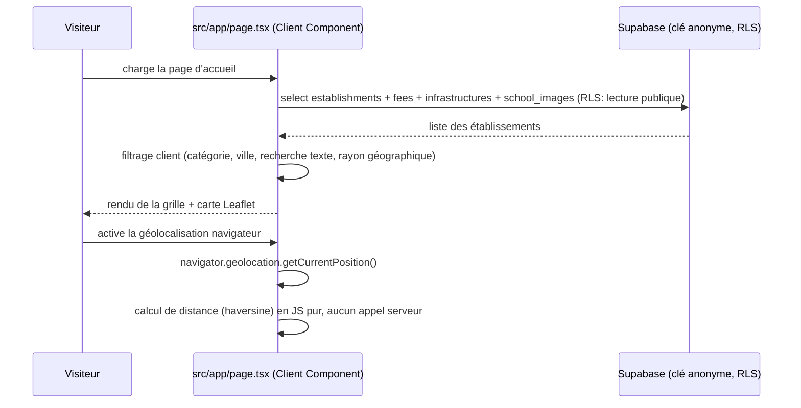

# 11 — Architecture As-Is

Ce document décrit exclusivement l'architecture telle qu'observable dans le code au commit audité. Aucune recommandation d'architecture cible ici — voir `13_RECOMMENDED_NEXT_STEPS.md` pour les priorités, la conception de la cible relevant de l'architecte produit/logiciel.

## 1. Diagramme de contexte

## 2. Diagramme des conteneurs

## 3. Flux d'authentification (tel qu'implémenté)

## 4. Flux de données principal — annuaire public

## 5. Intégration Supabase — vue d'ensemble

| Aspect | Constat |
|---|---|
| Clients utilisés | 3 (navigateur anon, serveur anon via cookies, serveur admin via service role) — voir `04_AUTH_AND_ROLES.md` §1 |
| RLS | Activé sur toutes les tables identifiées ; c'est le **seul** rempart pour les mutations côté client — voir la réserve importante sur `establishments` (`06_SECURITY_AUDIT.md` R-001) |
| Fonctions RPC | `current_establishment_id()` (résolution centrale de l'établissement courant, `security definer`), `calculer_heures_enseignant()` (calcul d'heures travaillées, plusieurs versions successives selon les migrations) |
| Triggers | `handle_new_user` sur `auth.users` (création automatique du profil, gère le rôle `teacher` depuis les métadonnées d'invitation) |
| Storage | 3 buckets identifiés (`pointages-photos` privé et versionné en SQL ; `school-images`/`school-documents` documentés seulement en commentaire, configuration réelle non vérifiable depuis ce dépôt) |
| Génération de types | Non utilisée — aucun fichier de types Supabase généré, d'où le recours généralisé à `any` (voir `07_CODE_QUALITY.md`) |

## 6. Services externes

| Service | Usage | Clé/config requise |
|---|---|---|
| Supabase | Base de données, authentification, stockage de fichiers | `NEXT_PUBLIC_SUPABASE_URL`, `NEXT_PUBLIC_SUPABASE_ANON_KEY`, `SUPABASE_SERVICE_ROLE_KEY` (non documentée dans `.env.example`, voir R-003) |
| OpenStreetMap (tuiles) | Fond de carte pour la géolocalisation | Aucune clé — service public, sans SLA contractuel |
| images.unsplash.com | Images de démonstration/hero (pas les photos réelles des écoles, qui passent par Supabase Storage) | Autorisé explicitement dans `next.config.js` (`images.remotePatterns`) |
| Aucun fournisseur de paiement intégré | `CLAUDE_CONTEXT.md` mentionne Orange Money/MTN MoMo via CinetPay comme cible — **aucune trace dans le code actuel** | — |
| Aucun service d'email transactionnel personnalisé | Les emails passent par la configuration par défaut de Supabase Auth (confirmation, invitation) | — |

## 7. Ce que cette architecture ne montre PAS (hors périmètre du code)

- Configuration réelle des buckets Storage dans le dashboard Supabase
- Politique de sauvegarde/rétention de la base Postgres
- Environnement de déploiement réel (aucune configuration de plateforme trouvée dans le dépôt)
- Toute surveillance, alerting ou journalisation applicative (aucun SDK de monitoring — Sentry, LogRocket, etc. — trouvé dans les dépendances)
