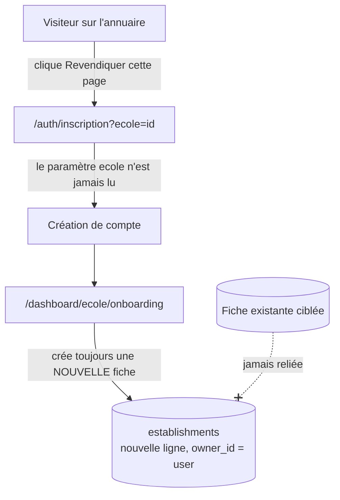
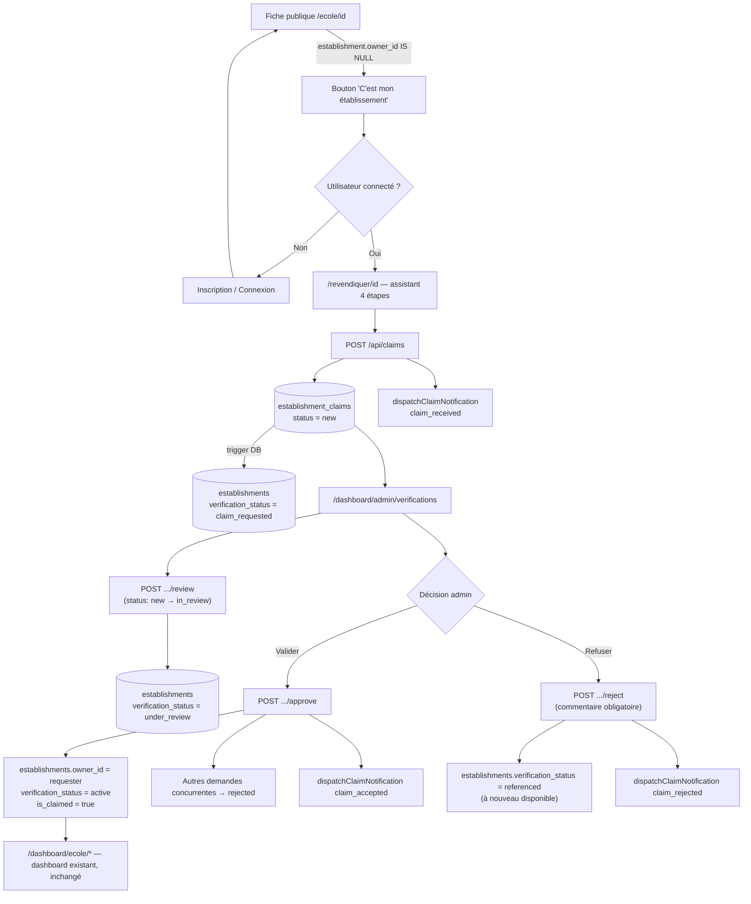

# FLOW — Parcours de revendication d'établissement

## 1. Fonctionnement actuel (avant cette mission) — diagnostic, Phase 1

Diagnostiqué par lecture du code, aucune modification à cette étape.

### Comment une école est créée aujourd'hui

Deux chemins, sans lien entre eux :

1. **Seed manuel** (`supabase/seed_schools.sql`) — 40 fiches insérées directement en SQL, `owner_id` toujours `null`.
2. **Onboarding utilisateur** (`src/app/dashboard/ecole/onboarding/page.tsx`) — un utilisateur connecté crée une **nouvelle** ligne `establishments` avec `owner_id = auth.uid()`. Ce flux crée toujours une fiche neuve, il ne relie jamais un compte à une fiche existante.

### Comment un compte est créé

`src/app/auth/inscription/page.tsx` → `supabase.auth.signUp()`. Le trigger Postgres `handle_new_user` (`auth-setup.sql`) crée automatiquement une ligne `profiles` avec `role = 'parent'` par défaut.

### Comment une école est liée à un utilisateur

Exclusivement via `establishments.owner_id = auth.uid()` — pas de table de jointure, pas de rôle dédié. `useSchool()` (`src/lib/useSchool.ts`) résout l'établissement d'un utilisateur connecté par cette seule colonne.

### Comment les rôles sont gérés

Enum `user_role` (`parent`, `establishment_admin` — jamais assigné, mort —, `platform_admin`, `teacher`). Aucun rôle "propriétaire d'établissement" distinct : un propriétaire d'école reste `role = 'parent'` au sens du profil ; c'est `owner_id` qui fait foi.

### Le bouton "Revendiquer cette page" existant AVANT cette mission

`src/app/page.tsx` contenait un lien `/auth/inscription?ecole=${id}` — jamais lu par `auth/inscription/page.tsx`. Un utilisateur qui cliquait dessus créait un compte, puis via l'onboarding, une **nouvelle** fiche — sans jamais se lier à la fiche qu'il visait. **Ce bouton et ce comportement ne sont pas modifiés par cette mission** (hors périmètre explicite — la mission ajoute un nouveau bouton "C'est mon établissement" sur la fiche école elle-même, un parcours distinct).

### Diagramme — état AVANT cette mission

## 2. Nouveau parcours — construit par cette mission

## 3. Points d'intégration avec l'existant

- **Aucune modification** de `dashboard/ecole/onboarding` (reste le flux "créer une nouvelle école").
- **Aucune modification** du dashboard école existant (`dashboard/ecole/*`) — une fois `owner_id` lié, il fonctionne automatiquement via `useSchool()`, sans aucun code nouveau nécessaire.
- **Aucune modification** du module Pro, des emplois du temps, des présences, de la paie, des enseignants — non touchés, conformément à la consigne.
