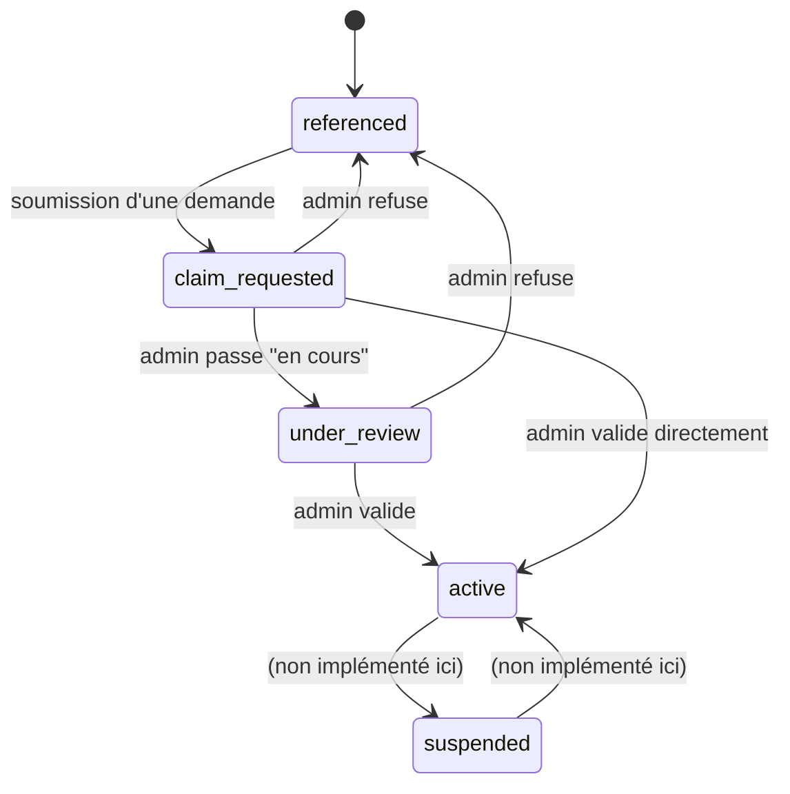

# STATES — États métier

Deux machines à états distinctes et reliées : l'état de l'**établissement** (`establishments.verification_status`)
et l'état de la **demande** (`establishment_claims.status`).

## Établissement — `establishment_verification_status`

| État | Signification | Déclenché par |
|---|---|---|
| `referenced` | Présent dans l'annuaire, jamais revendiqué (ou revendication précédente refusée) | État par défaut à la création ; retour ici après un refus |
| `claim_requested` | Une demande de revendication est en cours | Trigger `establishment_claims_after_insert` (soumission du formulaire) |
| `under_review` | L'équipe Écoles237 analyse les justificatifs | `POST /api/admin/claims/[id]/review` |
| `verified` | Concept intermédiaire — voir note ci-dessous | — |
| `active` | Dashboard activé, Administrateur Principal lié (`owner_id` renseigné) | `POST /api/admin/claims/[id]/approve` |
| `suspended` | Accès suspendu (action de modération) | **Non implémenté dans cette mission** — enum prêt, aucune UI/route ne déclenche cette transition (aucune phase de la mission ne le demandait explicitement) |

**Note sur `verified` vs `active`** : la mission décrit ces deux états comme séquentiels ("VERIFIED : l'établissement
est validé" puis "ACTIVE : le dashboard est activé"). Dans l'implémentation, la validation d'une demande
(`approve`) fait passer l'établissement directement à `active`, qui implique la validation — le dashboard
`dashboard/ecole/*` n'a aucune notion d'un état "validé mais dashboard pas encore actif" à modéliser séparément
(il s'active automatiquement dès que `owner_id` est renseigné). L'enum conserve `verified` pour une éventuelle
distinction future (ex. si un jour la validation et l'activation du dashboard devenaient deux actions séparées).

### Diagramme d'états

## Demande — `claim_status`

Correspond exactement aux 4 colonnes demandées pour le dashboard admin (Phase 5) :

| Valeur DB | Libellé admin (mission) | Signification |
|---|---|---|
| `new` | Nouvelle | Demande soumise, pas encore examinée |
| `in_review` | En cours | Un admin a commencé l'analyse |
| `accepted` | Acceptée | Demande validée — établissement lié |
| `rejected` | Refusée | Demande refusée (avec commentaire obligatoire) |

### Règles de transition (appliquées dans le code, pas seulement documentées)

- `new → in_review` : `POST /api/admin/claims/[id]/review`.
- `new → accepted` **ou** `in_review → accepted` : `POST /api/admin/claims/[id]/approve` (l'admin peut valider
  directement sans passer par "en cours" — flexibilité volontaire, pas d'obligation de cliquer un bouton
  intermédiaire).
- `new → rejected` **ou** `in_review → rejected` : `POST /api/admin/claims/[id]/reject`.
- `accepted`/`rejected` sont des états terminaux — aucune route ne permet d'en sortir (une nouvelle demande doit
  être soumise si l'établissement redevient `referenced` après un refus).
- Quand une demande est acceptée, **toute autre demande concurrente** (`new`/`in_review`) pour le même
  établissement est automatiquement basculée en `rejected` (voir `approve/route.ts`) — un établissement ne peut
  avoir qu'un seul Administrateur Principal.
